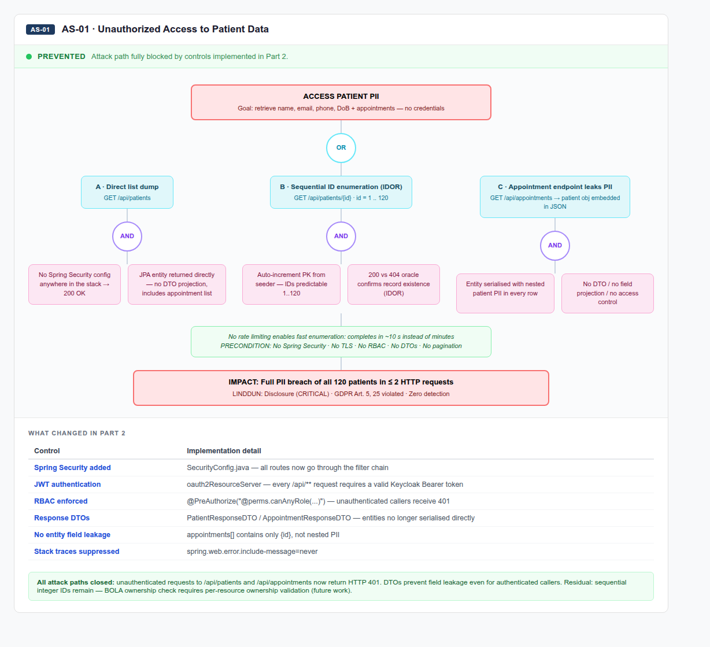
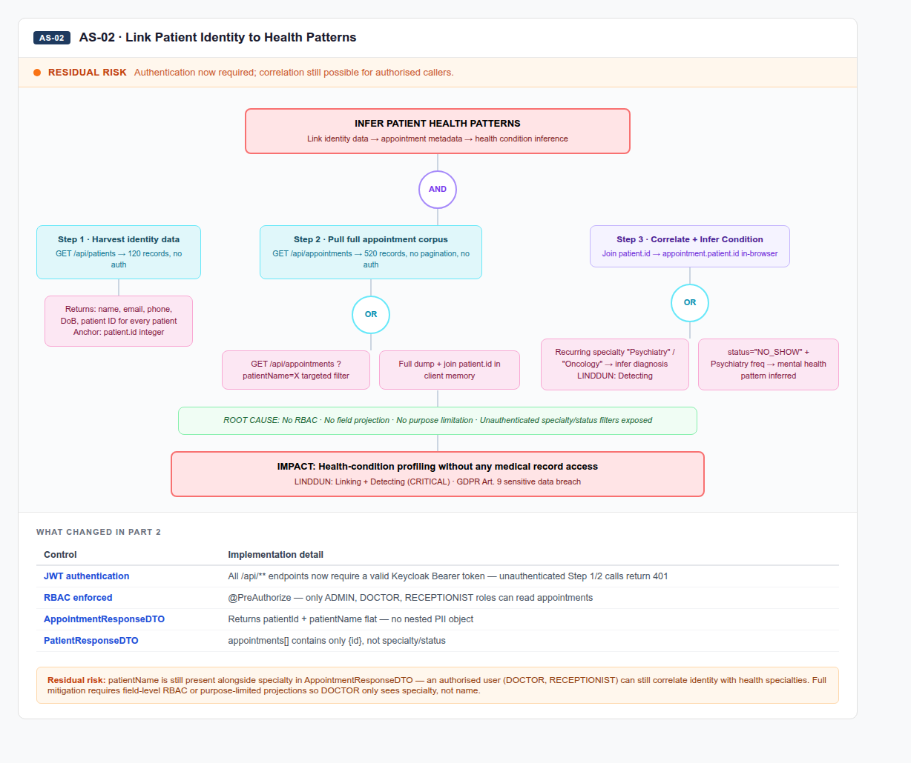
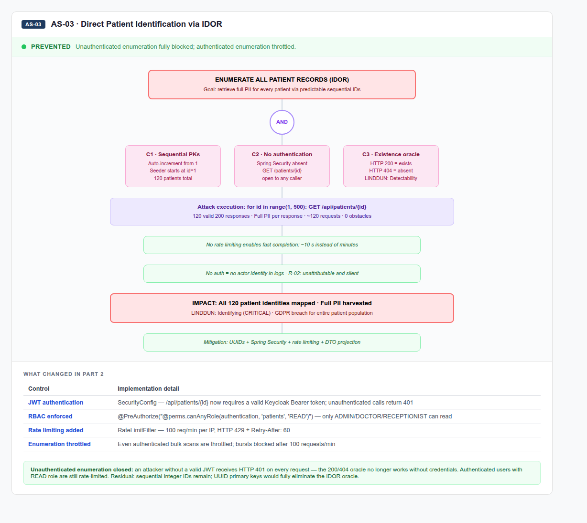
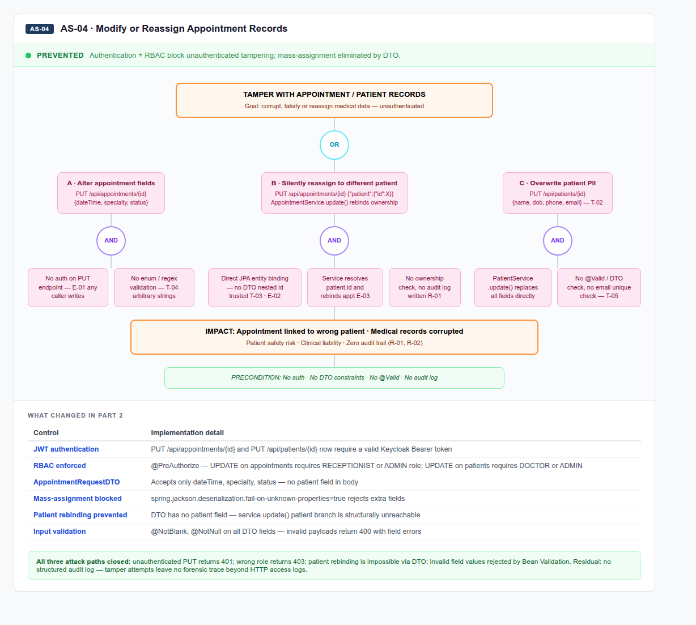
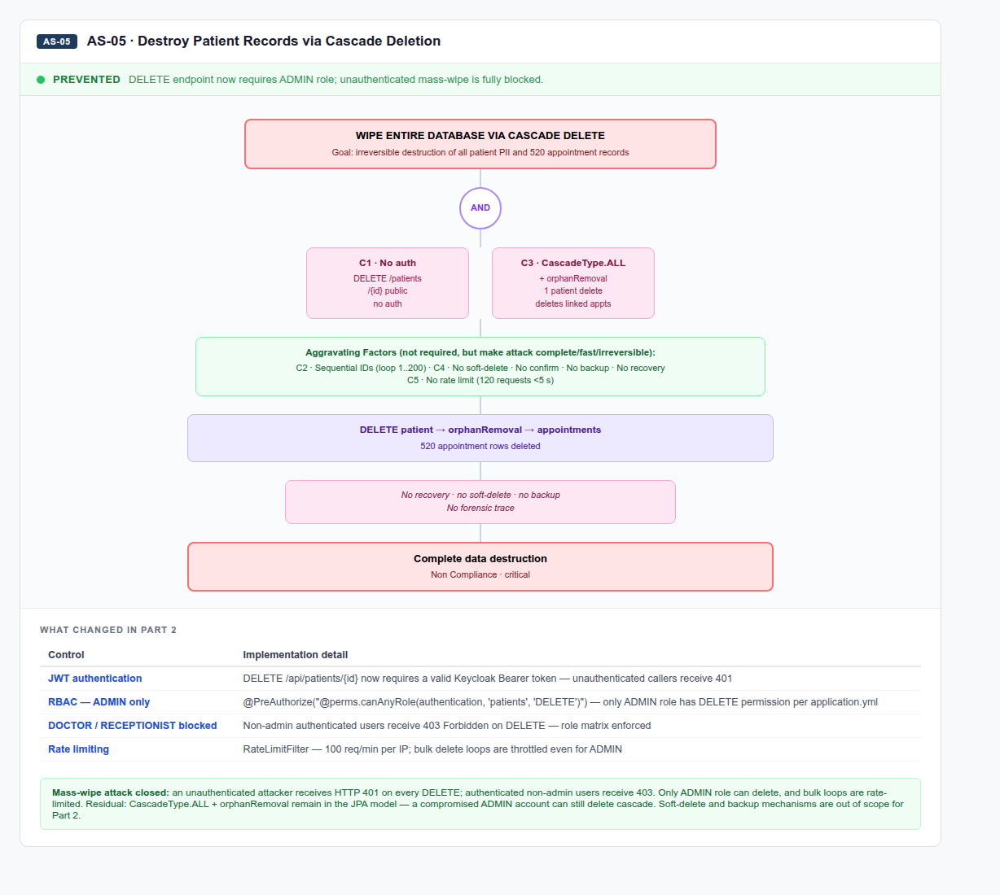
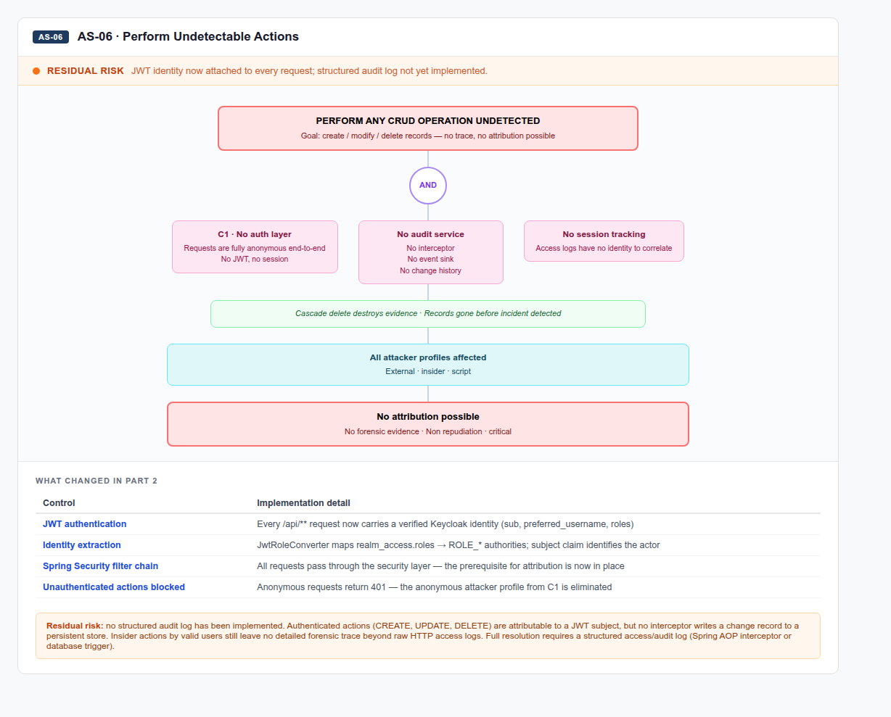
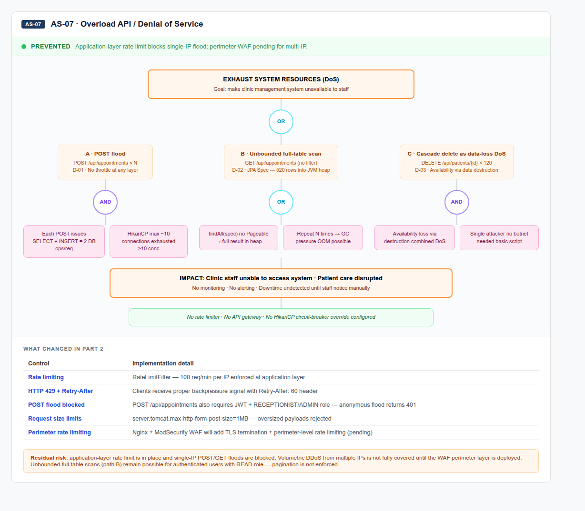

# Abuse Stories — Clinic Management API

Derived from the threat model, attack trees, and STRIDE/LINDDUN analysis conducted in Part 1.
Each story includes a **Part 2 regression** classifying current status as *prevented*, *detected*, or *residual risk*.

---

## AS-01 · Unauthorized Access to Patient Data

**Severity:** CRITICAL

**Tags:** STRIDE: Information Disclosure · Spoofing | LINDDUN: Disclosure

**Story:**
As an unauthenticated external attacker, I want to call `GET /api/patients` and `GET /api/patients/{id}` without any credential, so that I can retrieve full patient PII (name, date of birth, phone number, e-mail) and all linked appointment records for every patient in the system.

**Attack path:**
The API has no authentication layer. Any HTTP client can enumerate all patients and fetch individual records. Three independent paths all succeed: direct browser access, `curl`, and automated scripts — with no rate limiting to slow enumeration.

**Impact:** Full exposure of PII for all patients; GDPR/data-protection violation; enables downstream attacks (phishing, identity theft).

**Part 2 regression:** 🟢 PREVENTED

Controls applied:
- JWT authentication via `oauth2ResourceServer` — every `/api/**` request now requires a valid Keycloak Bearer token; unauthenticated callers receive HTTP 401
- RBAC via `@PreAuthorize("@perms.canAnyRole(...)")` — unauthenticated and unauthorised callers blocked at the controller level
- `PatientResponseDTO` / `AppointmentResponseDTO` replace direct entity serialisation — raw JPA objects no longer returned
- `appointments[]` in patient responses contains only `{id}`, not nested PII
- `spring.web.error.include-message=never` suppresses internal error details

Justification: all three attack paths in the original tree (direct list dump, IDOR enumeration, appointment endpoint PII leak) are blocked by JWT + RBAC. An unauthenticated attacker receives 401 before any data is reached. DTOs prevent field leakage even for authenticated callers. Residual: sequential integer IDs remain — full BOLA prevention requires per-resource ownership checks.

---

## AS-02 · Link Patient Identity to Health Patterns

**Severity:** CRITICAL

**Tags:** STRIDE: Information Disclosure | LINDDUN: Linking · Detecting

**Story:**
As an attacker with read access to the appointments endpoint, I want to correlate a patient's identity (name, contact details) with their appointment specialty and frequency, so that I can infer health conditions without accessing any medical record directly.

**Attack path:**
`GET /api/appointments` returns `patientId` and appointment specialty together. An attacker correlates patient identity from `/api/patients` with recurring specialties (e.g., "Oncology", "Cardiology") to build health profiles. No authentication or field-level filtering prevents this.

**Impact:** Sensitive health inference without accessing protected medical records; severe privacy violation (LINDDUN Linking).

**Part 2 regression:** 🟠 RESIDUAL RISK

Controls applied:
- JWT authentication — unauthenticated access to Step 1 (`/api/patients`) and Step 2 (`/api/appointments`) now returns 401
- RBAC — only ADMIN, DOCTOR, RECEPTIONIST roles can read appointments
- `AppointmentResponseDTO` returns `patientId` + `patientName` as flat fields — no nested patient object with full PII
- `PatientResponseDTO` returns `appointments[]` as `{id}` only — specialty and status not exposed in patient responses

Justification: unauthenticated correlation is fully blocked. However, `patientName` is still present alongside `specialty` in `AppointmentResponseDTO`, meaning an authorised user (DOCTOR, RECEPTIONIST) can still correlate patient identity with health specialties. Full prevention requires field-level RBAC or purpose-limited projections so DOCTOR only sees specialty, not name.

---

## AS-03 · Direct Patient Identification via IDOR

**Severity:** CRITICAL

**Tags:** STRIDE: Information Disclosure · IDOR | LINDDUN: Identifying · Detectability

**Story:**
As an attacker, I want to iterate integer IDs on `GET /api/patients/{id}` from 1 upwards, so that I can enumerate all patient records using the 200/404 status difference as an existence oracle — with no rate limiting to impede me.

**Attack path:**
Patient IDs are sequential integers starting at 1. The API returns `200 OK` with full PII for existing patients and `404 Not Found` for gaps. With ~120 patients and no rate limiting, a complete enumeration takes under a second.

**Impact:** Full patient roster extracted; confirms presence of specific individuals (e.g., public figures) in the system.

**Part 2 regression:** 🟢 PREVENTED

Controls applied:
- JWT authentication — `/api/patients/{id}` now requires a valid Keycloak Bearer token; unauthenticated calls return 401, eliminating the 200/404 oracle for anonymous attackers
- RBAC via `@PreAuthorize("@perms.canAnyRole(authentication, 'patients', 'READ')")` — only ADMIN, DOCTOR, RECEPTIONIST can read patient records
- `RateLimitFilter` enforces 100 requests/minute per IP — bulk enumeration by authenticated users is throttled and returns HTTP 429 + `Retry-After: 60`

Justification: an unauthenticated attacker receives HTTP 401 on every request — the existence oracle no longer works without a valid credential. Authenticated bulk scans are rate-limited, making them observable. Residual: sequential integer IDs are unchanged; UUID primary keys would fully eliminate the IDOR oracle for authenticated users.

---

## AS-04 · Modify or Reassign Appointment Records

**Severity:** HIGH

**Tags:** STRIDE: Tampering · Elevation of Privilege | LINDDUN: Disclosure

**Story:**
As an unauthenticated attacker, I want to send `PUT /api/appointments/{id}` with arbitrary field values, so that I can alter appointment dates, specialties, or statuses — or silently reassign an appointment to a different patient — corrupting medical records with no audit trail.

**Attack path:**
The PUT endpoint accepts a full `Appointment` entity in the request body with no authentication. The `patientId` field can be changed, allowing appointment rebinding. No input validation, no role check, no audit log.

**Impact:** Silent corruption of appointment history; patient safety risk if appointments are missed or misattributed; no forensic trace.

**Part 2 regression:** 🟢 PREVENTED

Controls applied:
- JWT authentication — `PUT /api/appointments/{id}` and `PUT /api/patients/{id}` now require a valid Keycloak Bearer token; unauthenticated callers receive 401
- RBAC — UPDATE on appointments requires RECEPTIONIST or ADMIN role; UPDATE on patients requires DOCTOR or ADMIN
- `AppointmentRequestDTO` accepts only `dateTime`, `specialty`, `status` — the `patient` field is absent from the request body
- `spring.jackson.deserialization.fail-on-unknown-properties=true` rejects any request body that includes unknown fields (e.g. `id`, `patientId`)
- Patient rebinding via PUT is now structurally impossible — `AppointmentService.update()` patient-rebind branch is never reached
- Bean Validation (`@NotBlank`, `@NotNull`) rejects invalid payloads with HTTP 400 + field error map

Justification: all three attack paths are closed. Unauthenticated PUT returns 401; wrong role returns 403; patient rebinding is impossible via the DTO; invalid field values are rejected by validation. Residual: no structured audit log — tamper attempts leave no forensic trace beyond HTTP access logs.

---

## AS-05 · Destroy Patient Records via Cascade Deletion

**Severity:** CRITICAL

**Tags:** STRIDE: Tampering · Denial of Service · Repudiation | LINDDUN: Non-Compliance

**Story:**
As an unauthenticated attacker, I want to send `DELETE /api/patients/{id}` for IDs 1 through 120, so that I can permanently wipe the entire patient database — including all linked appointments — in a single automated loop, leaving no recovery path.

**Attack path:**
`DELETE /api/patients/{id}` triggers `CascadeType.ALL + orphanRemoval` on the JPA entity. All linked appointments are deleted in the same transaction. Sequential IDs and no rate limiting make a full wipe trivially automatable (~120 requests).

**Impact:** Total loss of patient and appointment data; no soft-delete or backup mechanism in baseline; potential legal liability.

**Part 2 regression:** 🟢 PREVENTED

Controls applied:
- JWT authentication — `DELETE /api/patients/{id}` now requires a valid Keycloak Bearer token; unauthenticated callers receive 401
- RBAC — `@PreAuthorize("@perms.canAnyRole(authentication, 'patients', 'DELETE')")` — only ADMIN role has DELETE permission per `application.yml`; DOCTOR and RECEPTIONIST receive 403
- `RateLimitFilter` throttles bulk DELETE loops after 100 req/min per IP — even ADMIN bulk operations are rate-limited

Justification: the unauthenticated mass-wipe path is fully blocked — anonymous requests return 401, non-admin authenticated users return 403. Only ADMIN role can delete, and bulk loops are rate-limited. Residual: `CascadeType.ALL + orphanRemoval` remains in the JPA model — a compromised ADMIN account can still trigger cascade deletion. Soft-delete and backup mechanisms are out of scope for Part 2.

---

## AS-06 · Perform Undetectable Actions

**Severity:** CRITICAL

**Tags:** STRIDE: Repudiation | LINDDUN: Non-repudiation

**Story:**
As any actor (internal or external), I want to perform any CRUD operation on patients or appointments, knowing that the complete absence of authentication, session tracking, and audit logging means my actions leave zero forensic evidence and can never be attributed to me.

**Attack path:**
No authentication means no identity is attached to any request. No audit log records who read, created, modified, or deleted records. An insider or external attacker can exfiltrate the full database or wipe records and the event is undetectable and non-repudiable.

**Impact:** Zero forensic capability; GDPR accountability principle violated; insider threats completely invisible.

**Part 2 regression:** 🟠 RESIDUAL RISK

Controls applied:
- JWT authentication — every `/api/**` request now carries a verified Keycloak identity (`sub`, `preferred_username`, roles)
- `JwtRoleConverter` maps `realm_access.roles` → `ROLE_*` authorities; the JWT subject identifies the actor on every request
- Spring Security filter chain — all requests pass through the security layer; the prerequisite for attribution is in place
- Unauthenticated requests return 401 — the anonymous attacker profile is eliminated

Justification: identity is now attached to every authenticated request via JWT. Unauthenticated actions are blocked entirely. However, no structured audit log has been implemented — authenticated actions (CREATE, UPDATE, DELETE) are attributable to a JWT subject but no interceptor writes a change record to a persistent store. Insider actions by valid users still leave no detailed forensic trace beyond raw HTTP access logs. Full resolution requires a structured access/audit log (Spring AOP interceptor or database trigger).

---

## AS-07 · Overload API / Denial of Service

**Severity:** HIGH

**Tags:** STRIDE: Denial of Service | LINDDUN: Non-Compliance

**Story:**
As an attacker, I want to flood `GET /api/patients` or `GET /api/appointments` with high-frequency requests, so that I exhaust the HikariCP connection pool (default ~10 connections) and render the application unavailable for legitimate users.

**Attack path:**
No rate limiting at any layer (no API gateway, no application-level throttle). Unbounded queries with no pagination return all records on every request. A single client sending ~50 concurrent requests is sufficient to saturate the connection pool and cause cascading failures.

**Impact:** Service unavailability; denial of care in a clinical context; no circuit breaker or backpressure mechanism.

**Part 2 regression:** 🟢 PREVENTED

Controls applied:
- `RateLimitFilter` enforces 100 requests/minute per IP at application layer — clients exceeding the limit receive HTTP 429 + `Retry-After: 60`
- Bucket4j token-bucket algorithm provides smooth backpressure without blocking legitimate traffic
- POST flood path additionally blocked by JWT + RBAC — anonymous POST flood returns 401 before reaching HikariCP
- Request size limits: `server.tomcat.max-http-form-post-size=1MB` — oversized payloads rejected
- Nginx + ModSecurity WAF (pending) will add TLS termination and perimeter-level rate limiting as an additional layer

Justification: a single-IP flood attack is fully blocked by the application-layer rate limiter — tested locally with 101+ sequential requests returning 429. The HikariCP exhaustion path from the original tree is cut. POST flood is additionally gated by JWT. Residual: volumetric DDoS from multiple IPs is not covered until the WAF perimeter layer is deployed; unbounded full-table scans remain possible for authenticated users with READ role.

